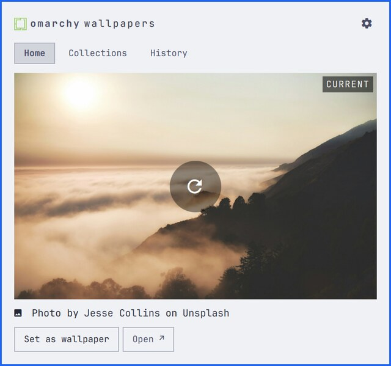
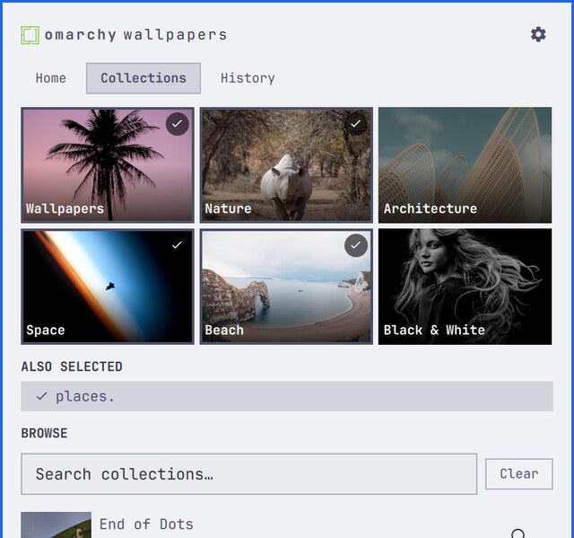
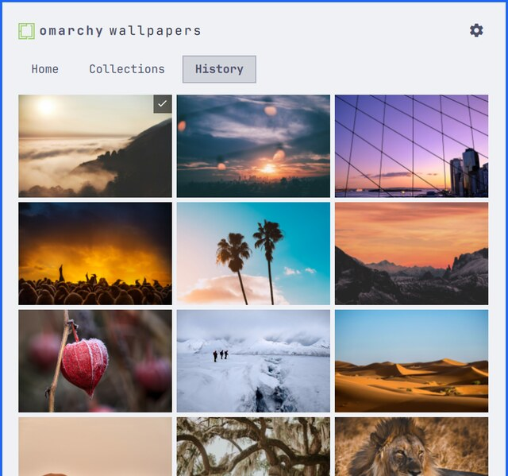

# Omarchy Wallpapers

A wallpaper browser in the Omarchy bar. Draw a random photo from the
collections you pick, set it as your wallpaper. An
[Omarchy](https://omarchy.org/) shell plugin, powered by
[Unsplash](https://unsplash.com/).

Not affiliated with or endorsed by Unsplash. The
[API guidelines](https://help.unsplash.com/en/articles/2511245-unsplash-api-guidelines)
forbid using their name in an application name or their logo as an app icon,
so this is "Omarchy Wallpapers"; every photo credits its photographer and
Unsplash, both linked.

Drawing and applying are separate — click the photo as often as you like;
nothing reaches your desktop until you press **Set as wallpaper**.

Requires Omarchy 4 (Quickshell-based shell).

## Install

```bash
omarchy plugin add https://github.com/wolfgangrittner/omarchy-wallpapers.git --enable --yes
```

Then add an access key (below).

Uninstall: `omarchy plugin remove wolfgangrittner.omarchy-wallpapers`

## Access key

The API needs a free key of your own — there is no unauthenticated endpoint.

1. Go to <https://unsplash.com/oauth/applications> and sign in, creating an
   Unsplash account if you need one.
2. **New Application**. Accept the API terms and guidelines, then give it any
   name and description — the key is yours, nothing is reviewed or published.
3. Copy the **Access Key** from the application page. *Not* the Secret key —
   this app never needs it.
4. In the panel, open settings (⚙), paste it in, press **Save**.

New applications run in **Demo** mode: 50 requests an hour. Only calls to
`api.unsplash.com` count; the photos themselves come from `images.unsplash.com`
and are free.

| Action | Requests |
|---|---|
| Curated grid discovery | 6, once ever — cached in config |
| New photo | 1 |
| Set as wallpaper | 1 — the download ping the guidelines require |
| Collection search | 1 — the default browse list caches for 30 minutes |

A draw-and-set cycle is 2, so roughly 25 wallpaper changes an hour. If you do
spend the hour, the panel says so and leaves the desktop alone: your wallpaper,
History, and re-applying an old photo keep working, because those come from the
image CDN. Only new draws and searches wait for the reset.

**Apply for Production** in the same dashboard raises the limit to 1,000/hour;
nothing here needs to change.

## Panes

| Home | Collections | History |
|---|---|---|
| [](screenshots/home.jpg) | [](screenshots/collections.jpg) | [](screenshots/history.jpg) |
| The photo on show. Click it — or the ⟳ over it — to draw another; **Set as wallpaper** applies it and closes the panel. | Six curated collections in a 3×2 grid, plus search for any other public collection. Tick any mix; **Wallpapers** is on out of the box, and unticking everything draws from all of Unsplash. | Every photo shown, applied or not. Click one to set it again. |

## Mouse

| | |
|---|---|
| Left-click icon | Open/close |
| Right-click icon | Open and draw a photo |
| Click photo | Draw another |
| Click a collection | Select/deselect as a source |
| Click history thumb | Set it, close |
| Right-click history thumb | Open on unsplash.com |

## Keys

| | |
|---|---|
| `1` `2` `3` | Home / Collections / History |
| `n` | Draw a photo |
| `Enter` | Apply and close (Collections: toggle) |
| `←↓↑→` `hjkl` | Move cursor |
| `/` | Search collections |
| `r` | Reload collections |
| `o` | Open on unsplash.com |
| `Esc` | Close |

## Config

`bin/ow-config set <key> <value>` · `unset <key>...` · `get`

| Key | Default | |
|---|---|---|
| `orientation` | `landscape` | `landscape`, `portrait`, `squarish` (also a button in ⚙) |
| `keep` | `10` | Downloaded wallpapers to keep |
| `historyMax` | `200` | History entries to keep |
| `minPhotos` | `10` | Hide collections offering fewer usable photos than this |
| `curated` | discovered | The six grid collections. Resolved on first run, cached here. Rebuild from ⚙. |
| `collections` | Wallpapers | Which collections photos are drawn from |

### The curated grid

Collection ids are never hardcoded. On first run `bin/ow-curated` searches
Unsplash for each of the six names and keeps the **largest match**, counted in
photos a free API key can actually fetch — `total_photos` minus `total_plus`.

That last part matters: the biggest "wallpapers" collection is entirely
Unsplash+ premium, and `/photos/random` answers 404 for it, so ranking on the
raw count picks a collection that silently returns nothing. It prefers
collections with at least 50 usable photos, falling back to the largest usable
one so a thin search term still yields a tile. Results are cached in `curated`;
**Rebuild curated** in ⚙ re-runs the lookup.

The same count drives the browse list: collections with fewer than `minPhotos`
fetchable photos are hidden, which removes Unsplash+ collections (0 usable) and
near-empty ones in a single rule. The pane says how many it hid.

Config lives in `~/.local/state/omarchy/settings/omarchy-wallpapers.json` (mode
0600) — outside `~/.config` so the access key stays out of dotfiles repos.

Two more live on the bar widget itself in `~/.config/omarchy/shell.json`, since
they are layout rather than behaviour: `columns` (history/curated grid width,
default 3) and `perPage` (collection search results, default 20).

## Files

Wallpapers download at your screen's native width to
`~/.config/omarchy/backgrounds/<theme>/unsplash-<id>.jpg`, so `omarchy theme bg
next` cycles them too. Only photos you apply are downloaded. The `keep` newest
are kept; older `unsplash-*.jpg` in that directory are deleted, nothing else.

State, all in `~/.local/state/omarchy/settings/`:

```
omarchy-wallpapers.json          key, orientation, collections, curated, limits
omarchy-wallpapers-current.json  photo currently applied
omarchy-wallpapers-history.json  every photo shown
```

Source:

```
Panel.qml              bar button + three-pane popup
CuratedCell.qml        one tile in the curated grid
SourceRow.qml          one row in the search/browse list
Model.js               endpoints, parsing, config, grid math
bin/ow-config          read/write config
bin/ow-curated         resolve the six curated collections
bin/ow-history         record photos shown
bin/ow-set-wallpaper   download, apply, prune
```

## IPC

```bash
omarchy-shell wallpapers toggle|open|close
omarchy-shell wallpapers next          # draw a photo
omarchy-shell wallpapers set           # apply the one on show
omarchy-shell wallpapers showPane home|collections|history
```

Bind in `~/.config/hypr/bindings.lua`:

```lua
o.bind("SUPER CTRL", "U", "omarchy-shell wallpapers toggle")
```

`next` then `set` on a systemd timer gives you rotation.

## Attribution

Every photo credits its photographer and Unsplash, both linked with the
required `utm_source`/`utm_medium` referral parameters; images are hotlinked
from the API's own URLs, and the download endpoint is pinged on apply — per the
[Unsplash API Guidelines](https://help.unsplash.com/en/articles/2511245-unsplash-api-guidelines).

## License

MIT
